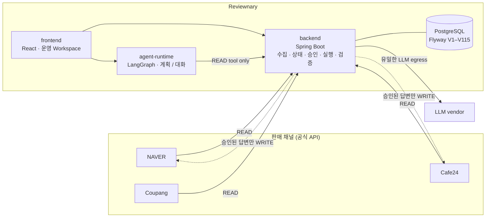

# Reviewnary

여러 판매 채널의 리뷰와 문의를 모아, 판매자가 **확인해야 할 일**과 **답변 초안**을 정리하는 고객운영
Workspace입니다.

## Why

소규모 다채널 판매자는 NAVER · Cafe24 · Coupang을 **각각 열어** 새 리뷰와 문의를 확인하고, 무엇부터
답할지 직접 판단하고, 회사 기준을 기억해 내 매번 답변을 다시 씁니다. 채널이 늘어날수록 늘어나는 것은
매출이 아니라 이 확인 비용입니다.

Reviewnary는 그 확인과 판단 **사이의 작업**을 대신합니다. 판매자가 내리는 결정 — 무엇을 보낼 것인가 —
은 그대로 사람에게 남겨 둡니다.

## What it does

- **수집** — 세 채널의 공식 API로 리뷰 · 문의 · 주문을 읽어 하나의 스키마로 정규화
- **확인할 일 통합** — 채널을 가로질러 "지금 판매자가 답해야 하는 것"을 한 목록으로
- **근거 있는 답변 초안** — 판매자가 등록한 상품 지식 · 운영 기준 · 과거 답변을 검색해 그 근거 위에서만
  초안을 쓰고, 근거가 없으면 **초안을 쓰지 않고 무엇이 없는지 말한다**
- **반복 리뷰 이슈 감지** — 같은 불만이 반복되면 묶어서 개선 지점으로 제시
- **Human Approval 기반 실행** — 판매자가 승인한 문장만, 단일 사용 승인에 묶여 채널로 나간다

## Product flow

```
채널 수집 → Operations Case → Knowledge / Investigation → Draft
         → Seller Decision → Execution → Verification
```

마지막 단계가 핵심입니다. 실행의 성공 판정은 **2xx가 아니라** 채널을 다시 읽어 게시된 글이 실제로
존재하고 승인된 초안과 같은지 확인한 결과입니다.

## What is actually proven

**구현됨**과 **라이브 증명됨**을 구분합니다. 아래는 실제 마켓플레이스 계정에 대해 실행되고 증거 행으로
남은 것만입니다.

**Live proven**

- NAVER · Cafe24 · Coupang 공식 API READ (주문 · 리뷰 · 문의) — 채널별 capability `CONFIRMED`, 재수집 멱등
- 세 채널 automatic source가 **하나의 production run**에서 수집 · 관측
- Cafe24 실고객 문의 → 근거 기반 모델 초안 → 판매자 승인 → **실제 답변 게시** → 채널 read-back 검증
- 그 한 번의 실행으로 inquiry · work item · case 상태가 **같은 요청 안에서 수렴**
- NAVER 상품 문의 답변 전송 — 단일 사용 승인 소진, read-back으로 판정

**Implemented, not live proven**

- **Cafe24 리뷰 댓글 전송** — 구현·로컬 증명 완료, 라이브 미실행
- **Coupang 문의 답변 / NAVER 고객 문의** — `OPERATOR_ASSISTED` (판매자가 채널에서 최종 클릭)
- **Coupang 리뷰 · NAVER 리뷰 직접 전송** — `NOT_SUPPORTED` (채널에 판매자 답글 경로 없음)
- **이미지 기반 상품 지식** — 기술 증명 완료, rollout 보류
- **파일럿 호스트** — 고정 공인 IP + 공개 HTTPS 호스트 미프로비저닝

실행 날짜 · 승인 id · 요청 수 · DB 델타 · 잔여 한계까지의 감사 기록:
[`docs/evidence/INDEX.md`](docs/evidence/INDEX.md) ·
[`docs/full_mvp_production_e2e_v1.md`](docs/full_mvp_production_e2e_v1.md).
채널 × 데이터 종류 × 방식의 단일 선언:
[`docs/multi-channel-connector-roadmap.md`](docs/multi-channel-connector-roadmap.md) §4.1

## Architecture



- `backend`가 **유일한 LLM egress**입니다. agent-runtime과 frontend는 벤더 키를 갖지 않습니다.
- agent-runtime의 tool 카탈로그는 **100% READ**이고, WRITE tool을 등록하려 하면 구조 테스트가 거부합니다.
  채널로 나가는 WRITE는 대화가 아니라 별도의 Action Executor가, 승인 뒤에만 수행합니다.

## Reliability / Engineering

이 저장소에서 실제로 풀어야 했던 문제들입니다.

- **멱등성** — 재수집은 `(channel, external_id)` 기준 upsert로 중복 0. 답변 전송은 단일 사용 승인 +
  `commandId` + `dispatch_key` unique index로 **한 번만** 나가고, 자동 재시도가 없습니다.
- **Fail-closed 실행 게이트** — 대상이 모호하거나 바뀌었으면 진행하지 않습니다. 2026-09-23에는 운영자가
  원격에서 대상 문의를 지운 상태로 실행을 시도했고, precondition guard가 **WRITE 이전에 중단**했습니다
  (`HALTED_AT_PRECONDITION`, 승인 미소진).
- **전송 검증** — 2xx를 성공으로 읽지 않습니다. 전송 직후 exact READ 1회로 자식 글 존재 · 부모 일치 ·
  답글 구조 · **본문 해시 == 승인 초안** · 부모 상태를 확인한 뒤에만 `VERIFIED`입니다. 게시는 됐으나
  완료 표시를 확정할 수 없는 경우는 성공도 실패도 아닌 별도 상태로 남습니다.
- **Responsibility scheduler / recovery** — 수집은 채널별 책임(responsibility) 단위로 창을 잡아 돌고,
  stale cursor · 중단된 run · 재연결을 스스로 회복합니다. 한 org의 실패가 다른 org를 멈추지 않습니다.
  (과거 실제 결함: 커서 wire format은 밀리초, 시계는 마이크로초 — 잘린 값 때문에 `isCaughtUp`이 영원히
  거짓이 되어 run이 종료하지 않았습니다. 회귀 테스트와 함께 수정.)
- **근거 검색(grounded retrieval)** — semantic(문장 단위 임베딩 + leave-one-out margin 부재 판정) +
  lexical fallback + **거절 전용** eligibility judge. **자체 구축한 내부 44문항 regression set**(설계에
  쓰지 않은 홀드아웃, 외부 벤치마크 아님)에서 recall 80.6% → 97.2%, wrong-source 인용 19.4% → **0%**.
  근거를 못 찾으면 모델을 호출하지도, 초안을 저장하지도 않습니다.
- **Production E2E 증거** — 라이브 실행은 전부 단일 사용 승인 하에 수행하고, 범위·요청 수·DB 델타·
  불변식을 기록한 행을 남깁니다. 증명되지 않은 것은 증명되지 않았다고 적습니다.

### Safety boundaries

- CAPTCHA / 2FA 우회 없음, 인증 우회 없음
- 숨겨진 연쇄 클릭 없음 — 수동 진행 경로가 항상 남습니다
- 자동 export / download / submit 없음 — **명시적 human checkpoint**를 통해서만
- 공식 API 우선. 사람이 확인해야 하는 동작은 Action Window 패턴 — 판매자가 마켓플레이스에서 누르고,
  Reviewnary는 결과를 감지·검증·처리만 합니다
- 출력은 sanitize — 자격 증명 · 토큰 · 쿠키 · 판매자 ID · 원본 페이지 · 개인정보는 나가지 않습니다

## Tech Stack

**Backend** Java 17 · Spring Boot 3.3 · Spring Data JPA · Spring Security (JWT + OAuth2) ·
PostgreSQL 16 · Flyway (113 migrations) ·
**Frontend** React 18 · TypeScript 5 · Vite 5 · Tailwind 3 · Vitest ·
**Agent runtime** Node · TypeScript · LangGraph · zod ·
**Local agent** TypeScript · Playwright ·
**Infra** Docker Compose · Caddy (pilot edge)

## Repository structure

```
backend/        Spring Boot 서비스 — 수집 · 정규화 · 지식 · 승인 · 실행 · 검증. 유일한 LLM egress
frontend/       React/Vite 운영 Workspace — 확인할 일 · 문의 · 리뷰 · 지식 · 설정
agent-runtime/  LangGraph 오케스트레이션 서비스(:8787) — 계획/대화, tool은 전부 READ
collector/      판매자 PC에서 도는 로컬 도우미 — 공식 API로 안 되는 취득의 Action Window 흐름
deploy/         파일럿 배포 — compose overlay · Caddy · preflight/smoke · 백업/복구
contracts/      런타임 간 공유 계약과 평가 코퍼스
docs/           제품/아키텍처 문서와 라이브 증거 (docs/evidence/INDEX.md)
```

> **Note** — 패키지 · 스키마 · 설정 키의 내부 식별자는 아직 `sellerops`입니다. 제품 이름만 Reviewnary로
> 옮겼고 내부 이름은 의도적으로 바꾸지 않았습니다.

## Running locally

```bash
cp .env.example .env
docker compose up --build
# frontend :5173 · backend :8080 · agent-runtime :8787 · postgres :5432
```

기본값은 **안전한 자세**입니다 — 모든 채널 커넥터 OFF, 모델 capability OFF, 스케줄러 OFF. 채널을 붙이려면
`.env`에 해당 자격을 넣어야 하고, 넣지 않은 채로 켜면 기동이 거부됩니다(fail-closed).

도커 없이 세 프로세스만 띄우려면:

```bash
tools/dev/local-stack.sh up      # backend + agent-runtime + frontend
tools/dev/local-stack.sh down
```

테스트:

```bash
backend/gradlew -p backend test
npm --prefix frontend test
npm --prefix agent-runtime test
npm --prefix collector test
```

## Status

**파일럿 준비 중.** Cafe24 문의 lane은 수집부터 검증까지 **라이브 증명 완료**이고, 리뷰 답글 전송 등
아직 라이브로 증명되지 않은 capability는 위 [What is actually proven](#what-is-actually-proven)에
그대로 표시돼 있습니다. 남은 blocker는 코드가 아니라 고정 공인 IP와 공개 HTTPS 호스트를 가진 파일럿
서버입니다.
